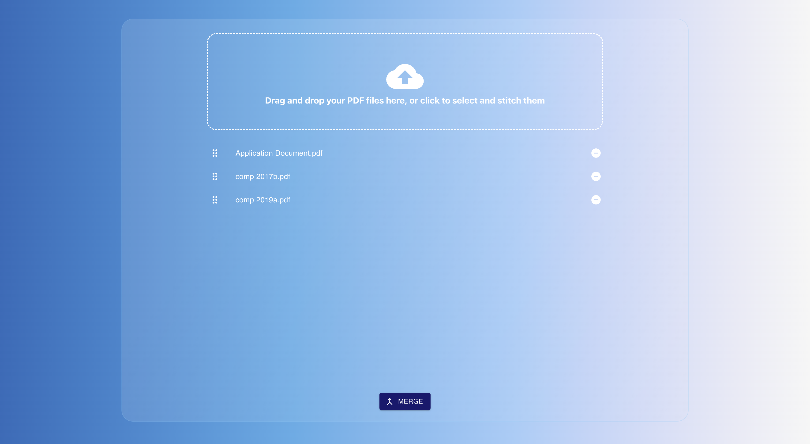
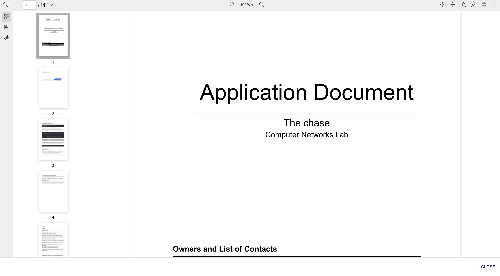
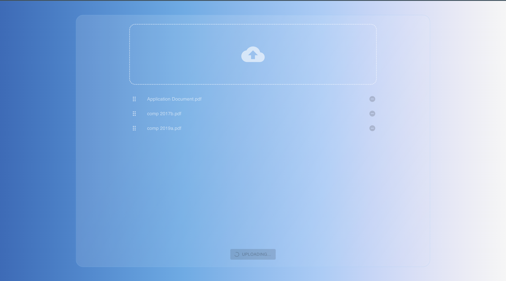
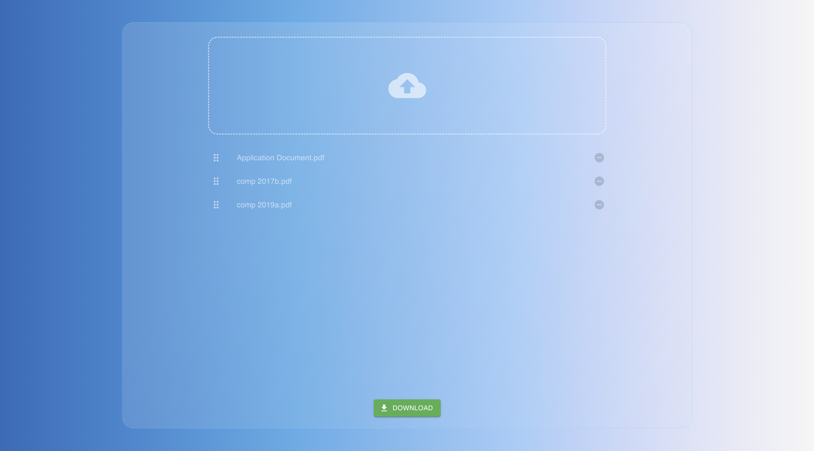

# StitchPDF-FrontEnd

**StitchPDF-FrontEnd** is the web interface for the StitchPDF application, enabling users to upload, reorder, and merge up to 5 PDF files through a smooth, responsive UI. It communicates with a [serverless backend](https://github.com/ibrahim-al-nakeeb/StitchPDF-BackEnd) built on AWS.

## Features

* **Drag-and-Drop PDF Upload**\
  Upload up to 5 PDF files using a drag-and-drop interface implemented with `@hello-pangea/dnd`.

* **File Reordering**\
  Files can be reordered on the client side via drag handles to define their merge sequence.

* **Direct S3 Upload via Pre-Signed URLs**\
  Each file is uploaded directly to an S3 bucket using temporary `PUT` URLs generated by the backend.

* **Merge Trigger via Metadata Upload**\
  A `trigger.json` file containing the `groupId` is uploaded to S3, triggering an AWS Lambda function to start the merge process.

* **Status-Aware Download Request**\
  The client makes a single request to check the status of the merged file. If the merge is complete (`SUCCESS`), it receives a pre-signed `GET` URL. If not (`PENDING`, `FAILED`, or `NOT_FOUND`), an appropriate message is shown to the user.

* **Merged PDF Download**\
  Upon successful processing, the client initiates a direct download of the merged file using a pre-signed S3 URL.

* **PDF Preview**\
  Supports in-browser viewing of uploaded and merged PDFs using `react-pdf-viewer`.

---

## Tech Stack

* **Framework**: React
* **UI Library**: [Material UI (MUI)](https://mui.com)
* **File Handling**: [`react-dropzone`](https://react-dropzone.js.org)
* **HTTP Client**: Axios
* **State Management**: React Hooks
* **Styling**: MUI theming + CSS-in-JS

---

## Screenshots

| Upload & Reorder                           | PDF Preview                                  |
|------------------------------------------- |--------------------------------------------- |
|  |  |

| Process                                    | Download                                     |
|------------------------------------------- |--------------------------------------------- |
|  |  |

---

## Getting Started

### Prerequisites

* Node.js (v20 or higher)
* Access to the [StitchPDF-BackEnd](https://github.com/ibrahim-al-nakeeb/StitchPDF-BackEnd) deployment (API Gateway + credentials)

### Installation

```bash
npm install
```

### Environment Variables

The following environment variables must be defined in a `.env` file at the root of the project to enable communication with the backend:

```env
REACT_APP_API_URL=<API Gateway base URL>
REACT_APP_API_KEY=<API key for authorized access>
```

#### Description:

* **REACT\_APP\_API\_URL**\
  The base URL of the backend's API Gateway.

* **REACT\_APP\_API\_KEY**\
  API key required to authenticate requests to backend endpoints.

> ⚠️ These variables are required at build time. Restart the dev server after editing the `.env` file.

### Run Locally

```bash
npm run dev
```

---

## Folder Structure

```
src/
├── App.jsx                    # Root application component
├── App.css                    # Global styles
├── index.js                   # React entry point
├── index.css                  # Entry styles

├── constants/                 # Static constants and enums
│   ├── index.js
│   └── stage.js

├── hooks/                     # Custom React hooks
│   ├── useDownloadMergedPdf.js
│   ├── useGenerateGroupID.js
│   ├── useUploadFile.js
│   └── index.js

├── utils/                     # Utility functions
│   ├── createSessionMetadataFile.js
│   ├── sleep.js
│   └── index.js

├── views/                     # Main UI views
│   ├── Main/
│   │   └── index.jsx          # Main view component
│
│   └── components/            # Reusable UI components
│       ├── DraggablePdfUploader/
│       │   └── index.jsx
│       ├── Dropzone/
│       │   └── index.jsx
│       ├── ErrorDialog/
│       │   └── index.jsx
│       ├── FullScreenPdfDialog/
│       │   └── index.jsx
│       ├── GlassyCard/
│       │   └── index.jsx
│       ├── Item/
│       │   └── index.jsx
│       └── PdfViewer/
│           └── index.jsx
```

---

## Notes

* **File Requirements**
  Only `.pdf` files are accepted. Each file must not exceed **10 MB** in size. Files failing validation are rejected on the frontend before upload.

* **Merge Order Control**
  The client defines the merge sequence by reordering files prior to uploading the `trigger.json`. The backend merges files based on the order they appear in the final list, which is inferred from the file names in S3.

* **Pre-Signed URL Usage**
  All file operations are performed using secure pre-signed URLs:

  * **Uploads** use `PUT` URLs that expire after 30 seconds.
  * **Downloads** use `GET` URLs that expire after a configurable duration (e.g., 5 minutes).

* **Stateless Backend**
  The backend does not retain file content. It relies on S3 object keys and metadata, with DynamoDB used only to track `groupId` status (`PENDING`, `SUCCESS`, or `FAILED`).

* **Trigger File Format**
  The merge process is initiated by uploading a `trigger.json` file to the same S3 prefix. This file must include a valid `groupId` string. No additional data is required.

* **Error Handling**
  If the merge fails, files are moved to a designated **Invalid** S3 bucket, and the DynamoDB entry is updated to `FAILED`. The client is notified with an appropriate error message when requesting a download URL.

---

## Limitations

- No retry logic for polling download status.
- Files must be uploaded and triggered in the same session.
- UI does not currently display detailed progress indicators.

---

## Contributing

Code contributions and pull requests are not accepted.  
However, you are welcome to open issues for bug reports, feedback, or feature suggestions.

---

<p align="center">
  
</p>